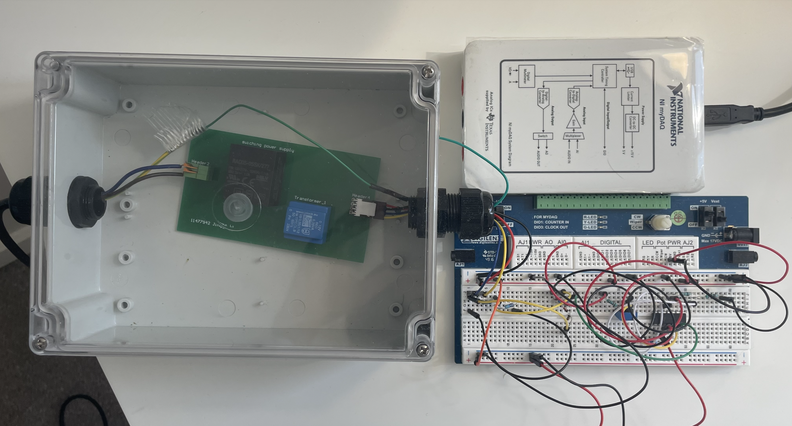
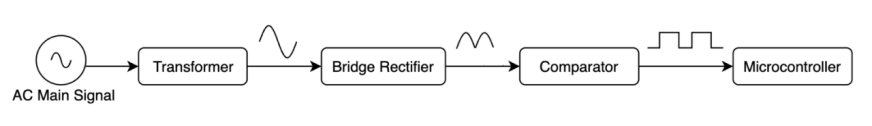
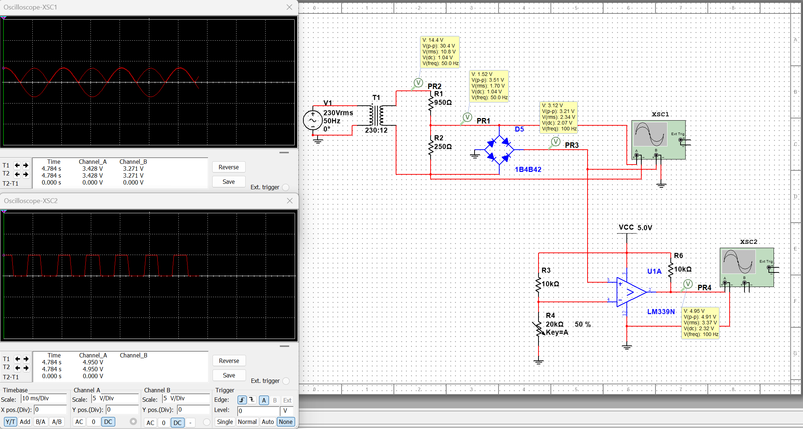
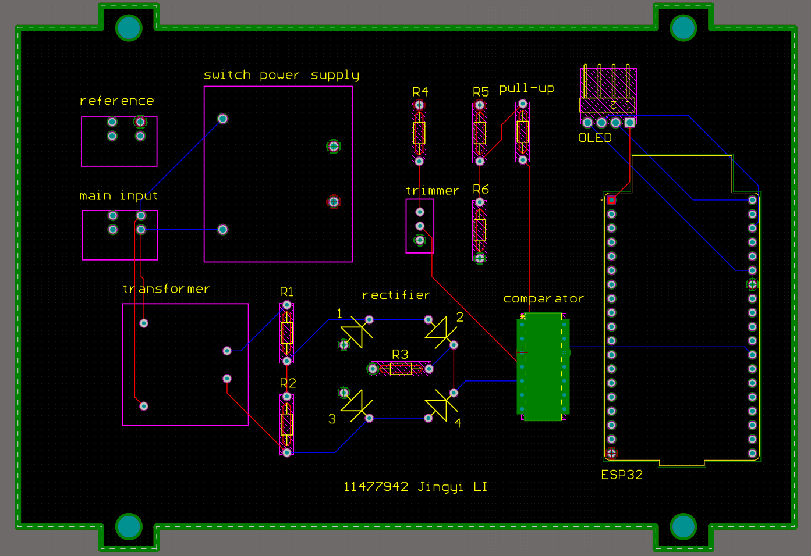
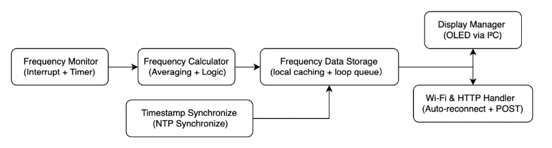
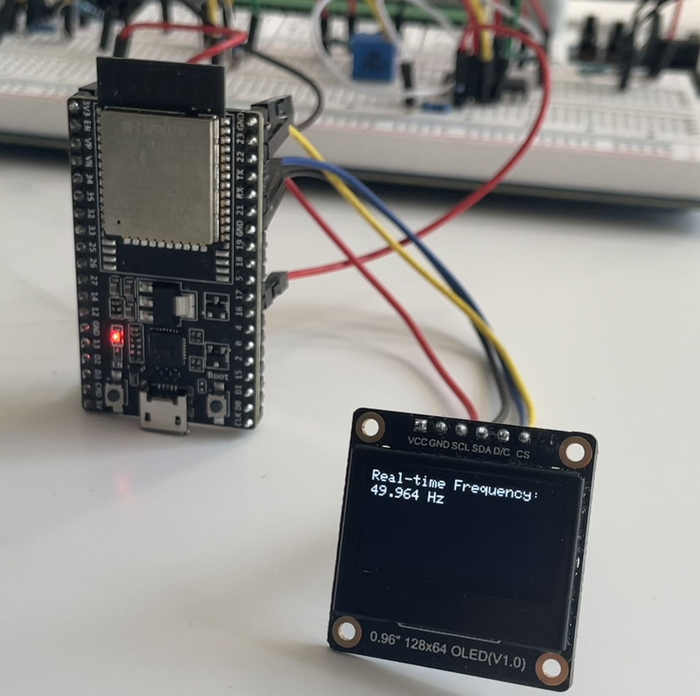
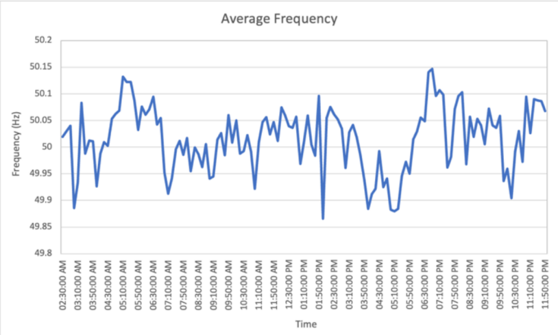
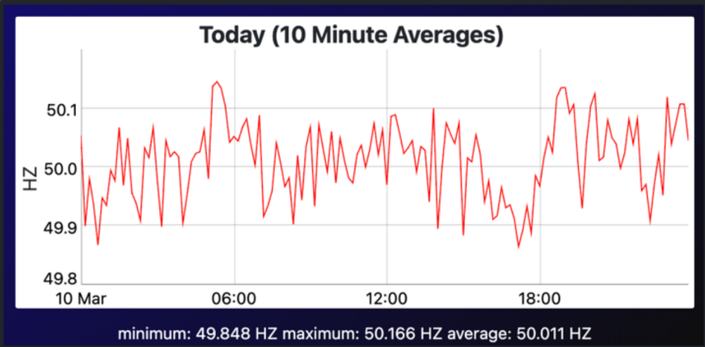

# Grid Frequency Monitor (ESP32)

A low-cost **real-time grid frequency monitoring device** based on ESP32.
The system measures mains frequency with high precision and uploads timestamped data to a cloud database for monitoring and analysis.

This project integrates **embedded hardware, signal conditioning circuits, real-time firmware, and cloud data logging** to create an open and scalable frequency monitoring platform.

  
  

## Overview

Maintaining stable grid frequency is critical for reliable power system operation.
Frequency reflects the real-time balance between power generation and demand, and deviations can indicate system disturbances or instability.

Traditional monitoring systems are often expensive and limited to large-scale infrastructure. This project explores a **low-cost embedded solution** for continuous frequency monitoring using a microcontroller-based platform.

The developed system is capable of:

- Measuring grid frequency in real time
- Displaying measurements locally on an OLED display
- Uploading timestamped data to a cloud database
- Performing long-term monitoring and analysis

Key features:

- Measurement accuracy ≈ **±0.01 Hz**
- Real-time **OLED display**
- **WiFi data upload** to InfluxDB
- Local **data buffering during network outages**
- **FreeRTOS multitasking firmware**

---

## System Architecture

The system consists of two main subsystems:

- Hardware signal acquisition
- Embedded firmware + cloud communication

The device measures grid frequency in real time, displays it locally, and uploads the data to a cloud database for remote monitoring.

  

---

# Hardware

## Hardware Design

The hardware subsystem is responsible for converting the mains voltage waveform into a stable digital signal.

  

Key components include:

| Component              | Function                                                         |
| ---------------------- | ---------------------------------------------------------------- |
| Step-down transformer  | 230V → 12V AC conversion; reduces mains voltage to a safe level |
| Switching power module | 220V → 5V DC power supply                                       |
| Rectifier circuit      | Converts AC waveform for signal processing                       |
| LM339 comparator       | Generates digital pulses from the waveform                       |
| ESP32 microcontroller  | Processes signal and performs frequency calculation              |
| OLED display           | Provides real-time measurement display                           |

The comparator outputs a **100 Hz square wave**, corresponding to the rectified mains signal.

To measure grid frequency, the ESP32 uses an **interrupt-based timing algorithm**.
Each rising edge of the comparator output triggers a GPIO interrupt.
Instead of calculating frequency from a single cycle, the system measures the time required for **10 complete AC cycles (20 edges)** and computes the frequency using the elapsed time.

This approach provides two advantages:

- Higher measurement stability by averaging multiple cycles
- Reduced sensitivity to noise or jitter in the signal

The frequency is calculated using: f = 10 / Δt, where Δt represents the measured time for ten AC cycles.

## Hardware Validation

Simulation and oscilloscope measurements were performed to verify circuit performance.

  
  

Hardware testing confirmed:

- Stable pulse generation
- Reliable signal conditioning
- Clean digital edges suitable for interrupt detection

---

# Firmware

## Firmware Architecture

The firmware runs on the ESP32 and is responsible for measurement, display, and communication.

  

The system uses **interrupt-based frequency measurement** combined with **FreeRTOS tasks**.

Main firmware modules include:

- GPIO interrupt handler for edge detection
- Frequency calculation module
- OLED display task
- Data buffering system
- WiFi communication module
- Cloud database upload task

This modular architecture ensures reliable real-time operation while handling network communication.

## Frequency Measurement Results

The measured frequency is displayed locally on the OLED screen.

  

The firmware calculates frequency by measuring the time interval between pulse edges.

Averaging over multiple cycles improves measurement stability while maintaining responsiveness.

---

# Results

Frequency measurements collected by the ESP32 were compared with external reference data.

  
  

The comparison shows strong agreement between the measured frequency and publicly available grid monitoring data.

Key observations:

- Measurement accuracy within approximately **±0.01 Hz**
- Stable operation over long monitoring periods
- Successful cloud data logging and retrieval

These results demonstrate that the proposed system can serve as a reliable **low-cost grid frequency monitoring solution**.

## Long-Term Reliability Test

To evaluate system stability, the monitoring device was operated continuously for **24 hours**.

During this test:

- Over **400,000 frequency samples** were recorded
- The ESP32 maintained stable WiFi connectivity
- Buffered data ensured no significant loss during temporary network interruptions

The long-term test demonstrated that the system can reliably perform continuous monitoring without system resets or instability.

---

# Future Work

Potential improvements include:

- digital filtering algorithms (moving average / Kalman filter)
- advanced visualization dashboards (Grafana)
- improved power filtering for EMI suppression
- distributed multi-node monitoring networks

These improvements could transform the system into a **scalable distributed grid monitoring platform**.
